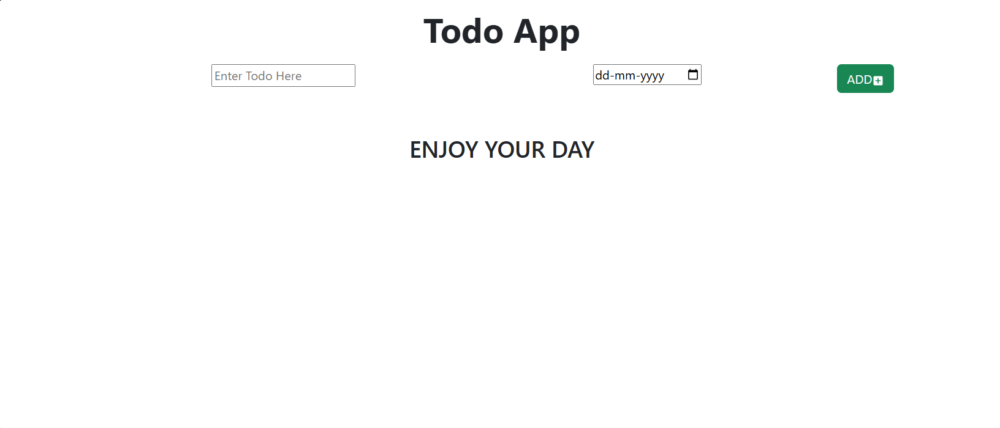

# Todo App

A simple and responsive Todo application built with React and Vite. This project was built to practice component-based architecture, state management, and modern frontend tooling.

## Features

- Add new tasks
- Delete tasks
- Clean and responsive UI

## Tech Stack

- React
- Vite
- CSS

## Getting Started

Follow these steps to run the project locally.

### Prerequisites

- Node.js installed on your machine

### Installation

```bash
git clone https://github.com/YOUR-USERNAME/todo-app-react.git
cd todo-app-react
npm install
npm run dev
```

The app will be running at `http://localhost:5173`

## Live Demo

[Click here to view the live app](YOUR-VERCEL-LINK-HERE)

## Screenshots



## What I Learned

- Managing component state using React Hooks (useState)
- Structuring a project with reusable components
- Deploying a React app using Vercel

## Author

**Kanika Verma**

[LinkedIn](https://linkedin.com/in/kanika-verma-0443b7315)
